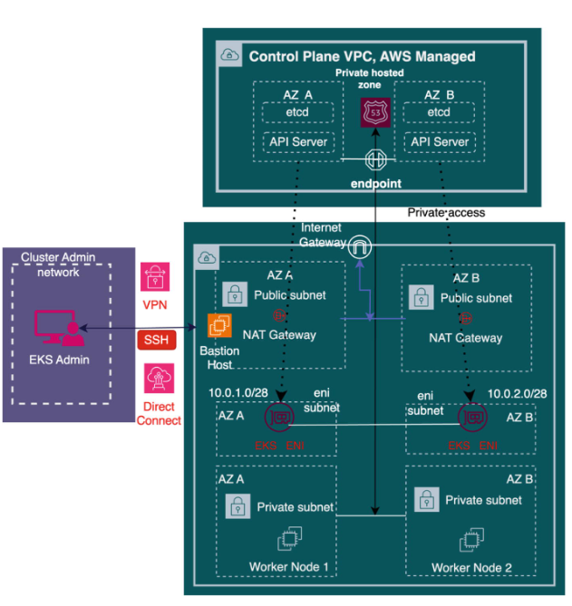

# Chapter 2: EKS Architecture and Cluster Access Control

## Opening the EKS "Black Box"

**Think of exploring EKS like unboxing a sophisticated new gadget:**

When you order a new product, you welcome it with open arms once it arrives. You carefully unbox it, ensure the package is intact, and can't wait to open its protective casing to dive deeper into its inner workings.

**Just like examining a new device:**
- **Identify individual components** → Understand EKS's core parts
- **Learn installation process** → See how components interconnect  
- **Explore usage patterns** → Discover configuration options for cluster operators

This approach provides valuable insights into EKS's design and functionality, helping you tailor it to meet diverse application needs.

### What We'll Uncover

In this chapter, we'll explore:
- **EKS Architecture** - The fundamental building blocks
- **Three Cluster Network Access Control Options** - How to secure and control access
- **Security Implications** - Understanding the impact of different access patterns

---

## The EKS Architecture: A Tale of Two Planes

**Think of EKS architecture like a modern airport system:**

The Amazon Elastic Kubernetes Service (EKS) employs a unified architecture with **two distinct operational areas**, just like an airport has different zones for different purposes.


*Figure 2-1: The Amazon EKS Architecture*

### The Two-Plane System

**EKS operates like a commercial airport with two main areas:**

#### 1. **Control Plane** = Air Traffic Control Tower
- **Managed by:** AWS (like the FAA managing air traffic control)
- **Purpose:** Makes all the big decisions and coordinates everything
- **Access:** Highly restricted - you can't just walk into the control tower

#### 2. **Data Plane** = Airport Terminal & Runways  
- **Managed by:** You (the customer) - like airport operators managing terminals
- **Purpose:** Where the actual work happens (planes take off, passengers board)
- **Location:** Your own AWS Virtual Private Cloud (VPC) network

### The Separation of Responsibilities

**Think of this like a secure government facility:**

**AWS-Managed Control Plane:**
- **Complete AWS responsibility** - like a classified government building
- **No direct customer access** - you can't walk in and touch the servers
- **API-only interactions** - like communicating through official channels only

**Customer-Managed Data Plane:**
- **Your responsibility** - like managing your own office building
- **Full control** - you decide what goes where
- **Operates in your VPC** - your own private network space

### Why This Architecture Matters

**This separation is like having a professional pilot and your own private jet:**

- **AWS handles the complex flying** (control plane management)
- **You control the passenger experience** (data plane applications)
- **Secure communication** between both through well-defined interfaces (APIs)

**Benefits:**
- **Security** - Critical infrastructure is protected by AWS
- **Flexibility** - You maintain control over your applications and data
- **Reliability** - AWS ensures the control plane is always available
- **Compliance** - Clear separation of responsibilities

---

## The Control Plane: The Brain of Your EKS Cluster

### What is the Control Plane?

**Think of the control plane like the command center of a space mission:**

The control plane is the **intelligent hub** of your EKS cluster - like Mission Control at NASA where all the critical decisions are made. Just as Mission Control monitors spacecraft, makes scheduling decisions, and responds to emergencies, the control plane handles:

- **Global decisions** → Application scheduling and cluster management
- **Event detection** → Monitoring for failures and system changes  
- **Resource coordination** → Ensuring everything runs smoothly
- **Crisis response** → Handling failures and recovery operations

### The Two-Team Approach: AWS + Kubernetes Components

**Think of the control plane like a modern hospital with two specialized teams:**

#### **Kubernetes (K8s) Components** = Medical Staff
- **Role:** Application orchestration (patient care)
- **Focus:** Making sure your applications run properly

#### **AWS Components** = Hospital Infrastructure Team  
- **Role:** Communication and hosting (building operations)
- **Focus:** Providing the platform for K8s components to operate

### The Kubernetes Medical Team: Core Components

**Each K8s component is like a specialized doctor in our hospital:**

#### **API Server** = Chief of Staff
- **Role:** Main communication hub
- **Function:** All requests go through the API server first
- **Analogy:** Like the head doctor who coordinates all medical decisions

#### **Scheduler** = Emergency Room Triage Nurse
- **Role:** Decides where to place new applications (pods)
- **Function:** Finds the best available resources for workloads
- **Analogy:** Determines which patient goes to which room based on needs and availability

#### **etcd Database** = Hospital Medical Records System
- **Role:** Stores all cluster configuration and state information
- **Function:** The single source of truth for everything in the cluster
- **Analogy:** Complete patient history that all doctors can access and update

#### **Controller Manager** = Hospital Department Supervisors
- **Role:** Ensures desired state matches actual state
- **Function:** Continuously monitors and fixes any deviations
- **Analogy:** Department heads who ensure each unit runs according to hospital policies

### The AWS Infrastructure Team: Supporting Components

**AWS provides the hospital building and utilities:**

#### **AWS-Managed VPC** = Hospital Building Infrastructure
- **Role:** Secure, isolated network environment
- **Function:** Houses all the K8s components safely

#### **Route 53 Private Hosted Zone** = Internal Hospital Phone System
- **Role:** DNS resolution within the cluster
- **Function:** Helps components find and communicate with each other

#### **VPC Endpoint** = Secure Communication Channels
- **Role:** Private connections to AWS services
- **Function:** Allows secure communication without going through the internet

### The Deployment Model: Secure and Managed

**Think of this like a high-security government facility:**

**AWS Responsibilities:**
- **Deploys K8s components** in their own secure VPC (like a classified building)
- **Manages all control plane operations** (like facility security and maintenance)
- **Ensures seamless communication** between control and data planes
- **No customer access** to control plane infrastructure (security clearance required)

**Customer Responsibilities:**
- **Manage the data plane VPC** (your own office space)
- **Deploy and manage applications** (your own work)
- **Choose deployment model** based on needs

### Deployment Options: Choose Your Level of Control

**Like choosing different types of office arrangements:**

#### **Standard EKS** = Shared Office Building
- **You manage:** Your office space (data plane VPC)
- **AWS manages:** Building infrastructure (control plane)

#### **Fargate Nodes** = Fully Serviced Executive Suite
- **AWS manages:** Everything - both control and data planes
- **You manage:** Just your applications (like having a personal assistant handle everything)

---

## The API Server: Your Cluster's Grand Central Station

### The Ultimate Communication Hub

**Think of the API Server like Grand Central Station in New York City:**

The API Server acts as the **communication gateway** for your entire EKS cluster - just like how Grand Central Station is the central hub where all trains, passengers, and information flow through one main terminal.

### Why Everything Goes Through the API Server

**Imagine the API Server as the reception desk at a high-security corporate headquarters:**

#### **Single Point of Entry**
- **All interactions** must go through the API server first
- **No direct access** to other components (like needing a visitor badge)
- **Centralized security** and authentication control

#### **Internal Communication Hub**
**Even cluster components talk to each other through the API server:**

Think of this like employees in a secure government building - even internal staff must go through security checkpoints to communicate between departments.

- **Scheduler** wants to place a pod → Must ask API server
- **Controller Manager** needs to check status → Must query API server  
- **External users** want to deploy apps → Must request through API server

### Exclusive Database Access: The Vault Keeper

**The API Server is like the head librarian with exclusive access to the rare books collection:**

#### **Sole Access to etcd Database**
- **Only the API Server** can read from and write to etcd
- **All cluster metadata** flows through this single gateway
- **Critical information stored:** 
  - Cluster configuration
  - Secrets and credentials
  - Application state
  - Resource definitions

#### **Why This Matters**
**This exclusive access is like having one trusted bank manager with the vault combination:**

- **Security** - Single point of control for sensitive data
- **Consistency** - No conflicting updates to the database
- **Audit Trail** - All changes are tracked through one interface
- **Data Integrity** - Prevents corruption from multiple simultaneous access

### The API Server's Role in Your Daily Operations

**Every action you take with your cluster goes through this gateway:**

- **`kubectl` commands** → API Server → etcd database
- **Application deployments** → API Server → Scheduler → Nodes
- **Status checks** → API Server → Current cluster state
- **Configuration changes** → API Server → Controller Manager → Implementation

**It's like having a super-efficient personal assistant who handles all your communications, keeps perfect records, and ensures nothing gets lost or misunderstood.**

---

## The etcd Database: Your Cluster's Memory Bank

### Understanding Distributed Systems and Their Challenges

**Think of an EKS cluster like a symphony orchestra performing across multiple concert halls:**

An EKS cluster is a **distributed system** where several nodes or instances work together to run workloads - just like musicians in different locations trying to play the same symphony in perfect harmony.

**The Challenge:**
- **Complex interconnections** between components (like musicians needing to stay synchronized)
- **High susceptibility to failures** (if one musician loses their sheet music, the whole performance suffers)
- **Coordination difficulties** (how do you keep everyone on the same page?)

### etcd: The Master Sheet Music Library

**Think of etcd like the master music library that keeps the definitive copy of every symphony:**

#### **What etcd Does**
- **Stores critical metadata** - Like keeping the original, authoritative sheet music
- **Maintains desired state** - Ensures everyone knows what the performance should look like
- **Enables failure recovery** - When a musician (node) loses their music, they can get a fresh copy

#### **Why This Matters for EKS**
**etcd is like having a perfect memory that never forgets:**

When failures occur in your distributed system:
1. **Node crashes** → etcd remembers what was supposed to be running there
2. **Network issues** → etcd maintains the truth about cluster state
3. **Configuration changes** → etcd keeps track of all modifications
4. **Application deployments** → etcd stores what should be deployed where

### The Key-Value Database: Simple but Powerful

**Think of etcd like a giant, super-reliable filing cabinet:**

#### **Key-Value Storage Model**
- **Key** = File folder label (like "Pod-WebApp-Production")
- **Value** = Complete file contents (all the details about that pod)
- **Simple structure** = Easy to find exactly what you need quickly

#### **What Gets Stored in etcd**
**Like a comprehensive business filing system:**

- **Cluster configuration** → Company policies and procedures
- **Application definitions** → Project specifications and requirements  
- **Resource states** → Current status of all company assets
- **Secrets and credentials** → Secure documents in locked cabinets
- **Network policies** → Security and access rules
- **Service definitions** → How different departments communicate

### The Reliability Factor: Why etcd is Critical

**etcd is like having multiple backup copies of your most important documents stored in different bank vaults:**

#### **High Availability**
- **Distributed across multiple locations** (usually 3 or 5 instances)
- **Automatic failover** if one copy becomes unavailable
- **Consistent data** across all copies

#### **Disaster Recovery**
**When things go wrong, etcd is your lifeline:**

- **Complete cluster rebuild** → etcd has all the blueprints
- **Rolling back changes** → etcd remembers previous configurations
- **Audit trail** → etcd tracks who changed what and when

### Why Only the API Server Can Access etcd

**This is like having a single, trusted librarian who controls access to rare manuscripts:**

- **Prevents data corruption** from multiple simultaneous writers
- **Ensures security** through centralized access control
- **Maintains consistency** by having one authoritative source
- **Enables proper validation** of all changes before they're stored

---

## The Controller Manager: Your Cluster's Quality Control Department

### The "Mother of All Controllers"

**Think of the Controller Manager like the head of a quality control department in a large manufacturing plant:**

The Controller Manager is the **"mother of all cluster controllers"** - like a department supervisor who manages multiple quality inspectors, each responsible for different aspects of production.

### Meet the Quality Control Team

**Each controller is like a specialized inspector with a specific job:**

#### **Node Controller** = Building Maintenance Inspector
- **Monitors:** Health of cluster nodes (like checking if machines are working)
- **Manages:** Node lifecycle (bringing new machines online, retiring old ones)
- **Ensures:** All worker nodes are healthy and available

#### **Replication Controller** = Production Line Monitor
- **Monitors:** Number of pod replicas running
- **Maintains:** Desired number of application instances
- **Ensures:** If one copy fails, new ones are automatically created

#### **Endpoint Controller** = Logistics Coordinator
- **Manages:** Mapping of services to pods
- **Ensures:** Traffic knows where to find healthy application instances
- **Updates:** Connection routes when pods come and go

#### **Service Account & Token Controllers** = Security Badge Office
- **Manages:** Service accounts and their credentials
- **Issues:** Security tokens for applications to authenticate
- **Ensures:** Only authorized services can access cluster resources

### How Controllers Work: The Continuous Monitoring Loop

**Think of controllers like security guards making regular rounds:**

#### **The Watch-and-React Pattern**
Controllers continuously monitor for three types of events:
1. **Create** → New resource added (like a new employee starting)
2. **Update** → Existing resource changed (like an employee changing departments)  
3. **Delete** → Resource removed (like an employee leaving)

#### **The Response Cycle**
**Like a vigilant security system:**

1. **Monitor** → Watch the API server for changes
2. **Compare** → Check current state vs. desired state (from etcd)
3. **Act** → Take corrective action if needed
4. **Repeat** → Continue monitoring continuously

### Real-World Controller Actions

**Controllers are like having multiple specialized assistants working 24/7:**

#### **Scenario 1: Pod Crashes**
- **Replication Controller notices** → "We should have 3 pods, but only 2 are running"
- **Takes action** → Requests API server to create a new pod
- **Scheduler gets involved** → Finds best node for the new pod
- **Result** → Desired state restored automatically

#### **Scenario 2: Node Fails**
- **Node Controller detects** → "Node-A isn't responding to health checks"
- **Takes action** → Marks node as unavailable
- **Other controllers react** → Move pods to healthy nodes
- **Result** → Applications continue running on different hardware

#### **Scenario 3: Service Update**
- **Endpoint Controller notices** → "New pods were added to this service"
- **Takes action** → Updates service routing to include new pods
- **Result** → Traffic automatically flows to all healthy instances

### Policy Enforcement: The Rule Keepers

**Controllers also act like compliance officers:**

#### **Admission Controllers** = Security Checkpoint
- **Function:** Enforce policies before resources are created
- **Example:** "Only pods with 'approved' labels can run on production nodes"
- **Analogy:** Like a bouncer checking IDs before letting people into a club

#### **Policy Examples:**
- **Resource limits** → "No pod can use more than 2GB of memory"
- **Security policies** → "All pods must run as non-root users"
- **Placement rules** → "Database pods must run on SSD-equipped nodes"

### The Communication Flow

**All controller actions follow a strict protocol:**

```
Controller → API Server → etcd → API Server → Action
```

**Like a proper chain of command:**
1. **Controller** sees an issue (field supervisor notices problem)
2. **Reports to API Server** (supervisor reports to management)
3. **API Server checks etcd** (management checks company policies)
4. **API Server authorizes action** (management approves solution)
5. **Controller implements fix** (supervisor fixes the problem)

### Why This Architecture Matters

**Having multiple specialized controllers is like having a well-organized emergency response team:**

- **Specialization** → Each controller is expert in their domain
- **Resilience** → If one controller fails, others keep working
- **Scalability** → Easy to add new controllers for new features
- **Consistency** → All changes go through the same API Server process

---

## The Scheduler: Your Cluster's Master Matchmaker

### The Art of Perfect Placement

**Think of the Scheduler like a world-class hotel concierge who finds the perfect room for every guest:**

The Scheduler is responsible for **assigning the most appropriate node** to every incoming workload or pod - just like how an expert concierge considers guest preferences, room availability, special requirements, and hotel policies to find the perfect match.

### The Decision-Making Genius

**The Scheduler is like a chess grandmaster who considers dozens of factors before making each move:**

#### **Core Responsibilities**
- **Analyzes incoming requests** → New pod needs a home
- **Evaluates all available options** → Which nodes could work?
- **Makes optimal decisions** → Selects the best possible placement
- **Considers complex constraints** → Balances multiple competing factors

### The Scheduler's Consideration Matrix

**Like a sophisticated real estate agent matching clients with properties:**

#### **Resource Requirements** = Budget and Space Needs
- **CPU needs** → "This application needs a powerful processor"
- **Memory requirements** → "This database needs lots of RAM"
- **Storage demands** → "This app needs fast SSD storage"
- **Network bandwidth** → "This streaming service needs high-speed connections"

#### **Hardware & Software Constraints** = Property Features
- **Node capabilities** → "Does this server have GPU acceleration?"
- **Operating system** → "Does this node run the right OS version?"
- **Architecture compatibility** → "Is this ARM or x86 compatible?"
- **Available resources** → "How much capacity is left on this node?"

#### **Policy Rules** = Zoning Laws and Regulations
- **Security policies** → "Production apps can't run on development nodes"
- **Compliance requirements** → "Financial data must stay in specific regions"
- **Resource quotas** → "This team can only use certain node types"
- **Access controls** → "Only approved workloads on secure nodes"

#### **Affinity & Anti-Affinity** = Neighborhood Preferences
**Like choosing where to live based on who your neighbors are:**

- **Pod Affinity** → "Place this web server near its database" (like wanting to live near friends)
- **Pod Anti-Affinity** → "Don't put two database replicas on the same node" (like avoiding noisy neighbors)
- **Node Affinity** → "This app prefers SSD-equipped nodes" (like preferring houses with garages)
- **Node Anti-Affinity** → "Avoid nodes in the same availability zone" (like avoiding flood-prone areas)

### Advanced Scheduling Considerations

**The Scheduler is like a logistics expert optimizing a complex supply chain:**

#### **Data Locality** = Minimizing Commute Time
- **Storage proximity** → "Place the app near its data to reduce latency"
- **Network topology** → "Consider bandwidth and connection costs"
- **Geographic distribution** → "Balance performance with disaster recovery"

#### **Inter-Workload Interference** = Avoiding Conflicts
- **Resource competition** → "Don't put two CPU-intensive apps on the same node"
- **Network conflicts** → "Separate high-bandwidth applications"
- **I/O interference** → "Balance disk-heavy and CPU-heavy workloads"

#### **Deadlines & Priorities** = Urgency Management
- **Critical applications** → "Production workloads get priority placement"
- **Time-sensitive tasks** → "Batch jobs can wait for optimal placement"
- **SLA requirements** → "Mission-critical apps need guaranteed resources"

### The Scheduling Algorithm in Action

**Like a sophisticated matching service that considers hundreds of factors:**

#### **Step 1: Filtering** = Initial Screening
```
"Which nodes could possibly work for this pod?"
- Has enough CPU? ✓
- Has enough memory? ✓  
- Meets constraints? ✓
- Passes policy checks? ✓
```

#### **Step 2: Scoring** = Detailed Evaluation
```
"Of the possible nodes, which is the best choice?"
- Resource utilization balance: 85/100
- Affinity preferences: 92/100
- Data locality: 78/100
- Overall score: Node-C wins!
```

#### **Step 3: Binding** = Final Assignment
```
"Officially assign the pod to the chosen node"
- Update etcd with the decision
- Notify the target node
- Begin pod startup process
```

### Real-World Scheduling Scenarios

**The Scheduler handles complex decisions every day:**

#### **Scenario 1: High-Priority Database**
- **Requirements:** 8 CPU cores, 32GB RAM, SSD storage
- **Constraints:** Must be in us-east-1, anti-affinity with other databases
- **Decision:** Places on dedicated database node with optimal resources

#### **Scenario 2: Web Application Scaling**
- **Requirements:** 2 CPU cores, 4GB RAM, near load balancer
- **Preferences:** Spread across availability zones for resilience
- **Decision:** Distributes replicas across multiple zones for high availability

#### **Scenario 3: Batch Processing Job**
- **Requirements:** High CPU, low priority, can tolerate delays
- **Strategy:** Waits for optimal placement during off-peak hours
- **Decision:** Schedules on underutilized nodes when resources become available

### Why Smart Scheduling Matters

**Good scheduling is like having a brilliant city planner:**

- **Resource Efficiency** → No wasted capacity, optimal utilization
- **Performance Optimization** → Applications run where they perform best
- **Cost Management** → Efficient resource usage reduces infrastructure costs
- **Reliability** → Smart placement improves fault tolerance
- **Scalability** → Intelligent decisions support growth

---

## Route 53 & DNS: Your Cluster's Address Book System

### Route 53: The Master Directory Service

**Think of Route 53 like the main telephone directory for a large corporation:**

Route 53 is one of the **AWS components in the control plane** that serves as the domain name service (DNS) for EKS clusters. Just like how a corporate directory converts employee names to phone extensions, Route 53 converts **Fully Qualified Domain Names (FQDNs) to IP addresses**.

#### **Route 53's Primary Job in EKS**
**Like a corporate switchboard operator connecting calls:**

- **Converts cluster API server FQDN** → IP address
- **Facilitates communication** between cluster components
- **Enables external access** to the API server
- **Maintains the address book** for critical cluster endpoints

### The Cluster Endpoint: Your Cluster's Main Phone Number

**Think of the cluster endpoint like the main reception number for a business:**

#### **What is the Cluster Endpoint?**
The cluster endpoint is the **URL assigned by EKS** during cluster provisioning - like getting a main phone number when you set up a new office.

#### **Purpose of the Cluster Endpoint**
**Like a central switchboard that routes all calls:**

- **Routes traffic** between data plane nodes and control plane API server
- **Provides external access** for clients and services outside the cluster
- **Serves as the single entry point** for all cluster management operations
- **Maintains consistent addressing** regardless of underlying infrastructure changes

### The Two-DNS System: Division of Labor

**Think of EKS DNS like having both a corporate directory and departmental phone lists:**

#### **Route 53** = Corporate Main Directory
- **Location:** Control plane (AWS-managed)
- **Responsibility:** API server endpoints and external connectivity
- **Scope:** Cluster-level addressing
- **Visibility:** Hidden from customer account (managed by AWS)

#### **CoreDNS** = Internal Department Directory
- **Location:** Data plane (customer-managed)
- **Responsibility:** Internal cluster resource resolution
- **Scope:** Pod-to-pod and service-to-service communication
- **Visibility:** Fully accessible within the cluster

### Route 53 Requirements: Setting Up the Phone System

**Like installing phone infrastructure in a new building:**

#### **Prerequisites in Your VPC**
Route 53 requires specific settings in your data plane VPC:

- **DNS Resolution Enabled** → Like having working phone lines
- **DNS Hostnames Enabled** → Like having proper address labels
- **Proper VPC Configuration** → Like having the right wiring infrastructure

#### **Why These Matter**
**Without proper DNS support, it's like having phones without a working directory service:**
- Nodes can't find the API server
- External clients can't connect to the cluster
- Internal communication breaks down

### CoreDNS: The Internal Phone System

**Think of CoreDNS like an advanced internal phone system for a large office complex:**

#### **What CoreDNS Does**
- **Default name server** for Kubernetes clusters
- **Flexible and extensible** DNS server
- **Resolves internal FQDNs** to IP addresses
- **Handles service discovery** within the cluster

#### **CoreDNS in Action**
**Like an internal directory that knows everyone's extension:**

**Example Resolution:**
```
Service Name: blue.namespacex.svc.cluster.local
↓ (CoreDNS resolves)
IP Address: 10.100.200.50
```

**Breaking down the FQDN:**
- **blue** → Service name (like "John" in accounting)
- **namespacex** → Namespace (like "accounting department")
- **svc** → Service type (like "employee" vs "contractor")
- **cluster.local** → Cluster domain (like "company.com")

### The DNS Division of Responsibilities

**Like having specialized phone operators for different types of calls:**

#### **Route 53 Handles:**
- **External-to-cluster communication** → Outside callers reaching the main number
- **API server endpoint resolution** → Finding the cluster's "front desk"
- **Cross-VPC connectivity** → Calls between different office buildings
- **AWS service integration** → Connecting to other AWS "departments"

#### **CoreDNS Handles:**
- **Pod-to-pod communication** → Internal employee calls
- **Service discovery** → Finding the right department extension
- **Internal load balancing** → Routing calls to available staff
- **Namespace-based routing** → Departmental directory services

### Real-World DNS Scenarios

**How the two DNS systems work together:**

#### **Scenario 1: External Client Connects**
1. **Client** queries Route 53 for cluster API endpoint
2. **Route 53** returns API server IP address
3. **Client** connects directly to API server
4. **API server** handles authentication and routing

#### **Scenario 2: Pod Calls Internal Service**
1. **Pod** queries CoreDNS for service FQDN
2. **CoreDNS** returns service IP address
3. **Pod** connects to service endpoint
4. **Service** load balances to healthy pods

#### **Scenario 3: Cross-Namespace Communication**
1. **Frontend pod** needs to reach backend service
2. **CoreDNS** resolves `backend.production.svc.cluster.local`
3. **Connection** established across namespace boundaries
4. **Traffic** flows through internal cluster networking

### Why This Two-Tier System Matters

**Like having both a main reception and departmental assistants:**

- **Separation of Concerns** → External vs internal addressing
- **Security** → Route 53 hidden from customer view
- **Flexibility** → CoreDNS customizable for internal needs
- **Reliability** → AWS manages critical external connectivity
- **Performance** → Internal DNS optimized for cluster traffic

---

## The Data Plane: Your Cluster's Factory Floor

### The "Muscle" of Your EKS Cluster

**Think of the data plane like the factory floor of a manufacturing plant:**

The data plane is the **"non-intelligent" part of the cluster** - but don't let that fool you! Just like a factory floor isn't where strategic decisions are made, but it's where all the actual work gets done, the data plane is where your applications come to life.

### What the Data Plane Does

**Like a well-organized factory floor with multiple production lines:**

#### **Primary Responsibilities**
- **Hosts the worker nodes** → Factory machines that do the actual work
- **Runs containerized applications** → Products being manufactured
- **Provides network infrastructure** → Conveyor belts and communication systems
- **Executes control plane decisions** → Follows instructions from management

#### **The Worker-Manager Relationship**
**Think of it like a construction site:**

- **Control Plane** = Project managers and architects (make decisions)
- **Data Plane** = Construction workers and equipment (execute the work)
- **Scheduler** = Foreman (assigns specific tasks to specific workers)
- **Nodes** = Individual workers with specialized skills and tools

### Nodes: Your Digital Workers

**Each node is like a skilled craftsperson with their own workstation:**

#### **What are Nodes?**
- **EC2 instances or servers** → Individual workstations
- **Execute assigned tasks** → Follow work orders from the scheduler
- **Run containerized applications** → Operate specialized equipment (containers)
- **Provide compute resources** → Bring CPU, memory, and storage to the job

#### **The Task Assignment Process**
**Like a well-managed workshop:**

1. **Control plane scheduler** decides what work needs to be done
2. **Scheduler** assigns tasks to the most suitable nodes
3. **Nodes** receive their work assignments
4. **Nodes** execute the tasks using their resources
5. **Results** are reported back to the control plane

### The Hybrid Architecture: Best of Both Worlds

**The data plane combines Kubernetes and AWS components, like having both skilled craftspeople and modern factory equipment:**

#### **Kubernetes Components in Data Plane**
- **kubelet** → Individual worker supervisor
- **kube-proxy** → Local networking coordinator  
- **Container runtime** → The actual tools for running applications

#### **AWS/EKS Components in Data Plane**
- **VPC networking** → Factory's electrical and plumbing systems
- **Security groups** → Access control and safety systems
- **Load balancers** → Distribution systems for incoming work

### Why "Non-Intelligent" Doesn't Mean "Simple"

**Think of the data plane like a Formula 1 race car:**

The car itself doesn't make strategic racing decisions (that's the driver and pit crew), but it's an incredibly sophisticated machine that:

- **Executes instructions perfectly** → Responds to driver input
- **Provides real-time feedback** → Telemetry data to the pit crew
- **Adapts to conditions** → Adjusts performance based on track conditions
- **Maintains high performance** → Delivers consistent, reliable operation

### The Division of Labor

**Like a well-organized restaurant:**

#### **Control Plane (Kitchen Management)**
- **Plans the menu** → Decides what applications to run
- **Coordinates orders** → Schedules workloads
- **Manages inventory** → Tracks cluster resources
- **Ensures quality** → Monitors application health

#### **Data Plane (Kitchen Staff)**
- **Prepares the food** → Runs the actual applications
- **Uses the equipment** → Operates on the physical infrastructure
- **Follows recipes** → Executes deployment specifications
- **Serves customers** → Delivers application services to users

### What's Coming in Part 2

**We're just scratching the surface of the data plane:**

The data plane contains sophisticated Kubernetes components that deserve detailed exploration:

- **How pods actually run on nodes**
- **Container runtime mechanics**
- **Networking between pods**
- **Storage management**
- **Security and isolation**

**Think of this chapter as meeting the factory floor supervisor - in Part 2, we'll meet each individual worker and understand exactly how they do their jobs.**

### Key Takeaway

**The data plane is where the magic happens:**

While the control plane makes all the smart decisions, the data plane is where your applications actually live, breathe, and serve your users. It's the difference between having a great business plan and actually running a successful business.

---

## Customer VPC: Your Private Digital Real Estate

### Your Own Piece of the AWS Cloud

**Think of the Customer VPC like owning your own office building in a large business district:**

The Customer VPC is **where EKS deploys your data plane resources** - it's your private, controlled space within the vast AWS cloud infrastructure. Just like how you can customize your office building while still being part of the larger business district, your VPC gives you control over your networking environment while leveraging AWS's global infrastructure.

### The Infrastructure Components: Building Your Digital Office

**Like setting up a modern office building with all the necessary utilities:**

#### **Customer-Managed Subnets** = Different Floors and Departments
- **Private subnets** → Secure internal offices (backend services)
- **Public subnets** → Reception areas with street access (load balancers, bastion hosts)
- **Database subnets** → Vault areas for sensitive data storage
- **Availability zone distribution** → Multiple building locations for redundancy

#### **Elastic Network Interfaces (ENIs)** = Network Jacks and Phone Lines
- **Dedicated network connections** for each resource
- **IP address assignments** for every component
- **Security group attachments** for access control
- **Multiple ENIs per instance** for complex networking needs

#### **Internet Gateways** = Main Building Entrance
- **Public internet access** → Front door for external visitors
- **Bidirectional communication** → People can come in and go out
- **Route table integration** → Proper signage and directions
- **Public IP management** → Official building address system

#### **NAT Gateways** = Secure Service Entrance
- **Outbound-only internet access** → Service door for deliveries and maintenance
- **Private subnet connectivity** → Internal departments can reach outside services
- **Security enhancement** → External parties can't initiate inbound connections
- **Managed AWS service** → Professional security service handling the door

### The Communication Flow: How Traffic Moves

**Like a well-designed office building with multiple access points:**

#### **Inbound Traffic (External → Internal)**
```
Internet → Internet Gateway → Public Subnet → Load Balancer → Private Subnet → Pods
```
**Like visitors entering through the main lobby, checking in at reception, and being escorted to the right department.**

#### **Outbound Traffic (Internal → External)**
```
Pods → Private Subnet → NAT Gateway → Internet Gateway → Internet
```
**Like employees making external calls through the company phone system - they can call out, but external parties can't call them directly.**

### Worker Nodes: Your Digital Employees

**Within your VPC office building, worker nodes are like dedicated workstations:**

#### **Worker Node Responsibilities**
- **Run the pods** → Execute applications (like employees doing their jobs)
- **Provide compute resources** → CPU, memory, storage (like workstation hardware)
- **Network connectivity** → Communication with other nodes and services
- **Local storage** → Temporary workspace for applications

#### **Pod Hosting**
**Think of pods like specific work assignments:**
- **Each pod** gets assigned to a worker node (like assigning a project to an employee)
- **Resource allocation** based on pod requirements (like providing the right tools for the job)
- **Isolation** between different pods (like separate workspaces for different projects)

### EKS ENIs: The Direct Phone Line

**EKS ENIs are like having a direct phone line between corporate headquarters and your office:**

#### **What EKS ENIs Enable**
- **Direct communication** from control plane to data plane
- **API server calls** to worker nodes (like management checking on project status)
- **Secure connectivity** without going through public internet
- **Low latency** communication for real-time coordination

#### **Why This Matters**
**Like having a dedicated communication channel:**
- **Security** → Private line that can't be intercepted
- **Performance** → No delays through public networks  
- **Reliability** → Direct connection reduces failure points
- **Control** → AWS manages the connection quality

### The Network Security Model

**Your VPC is like a secure office building with multiple layers of protection:**

#### **Security Groups** = Individual Office Access Cards
- **Instance-level security** → Who can access each workstation
- **Port-based rules** → Which services are available
- **Source/destination control** → Which departments can communicate

#### **Network ACLs** = Building-wide Security Policies
- **Subnet-level security** → Floor-by-floor access control
- **Stateless rules** → Explicit allow/deny for each direction
- **Additional layer** → Belt-and-suspenders security approach

### Real-World VPC Scenarios

**How your VPC supports different application architectures:**

#### **Scenario 1: Web Application**
- **Public subnet** → Load balancer facing internet
- **Private subnet** → Web servers protected from direct access
- **Database subnet** → Data storage in most secure area
- **NAT gateway** → Web servers can download updates

#### **Scenario 2: Microservices Architecture**
- **Multiple private subnets** → Different services in separate areas
- **Service mesh networking** → Internal communication pathways
- **API gateways** → Controlled external access points
- **Cross-AZ deployment** → Services distributed across multiple locations

#### **Scenario 3: Batch Processing**
- **Private subnets only** → No external access required
- **NAT gateway** → Download data and upload results
- **Spot instances** → Cost-effective compute for non-critical timing
- **Auto-scaling** → Dynamic resource allocation

### Why Customer VPC Control Matters

**Having your own VPC is like owning vs. renting office space:**

#### **Benefits of VPC Ownership**
- **Network customization** → Design your own floor plan
- **Security control** → Set your own access policies
- **Compliance alignment** → Meet your industry requirements
- **Cost optimization** → Choose the right resources for your needs
- **Integration flexibility** → Connect to your existing infrastructure

#### **Responsibility Model**
- **AWS manages** → The building infrastructure (physical data centers)
- **You manage** → Your office layout and security (VPC configuration)
- **Shared responsibility** → Building utilities and your office setup work together

---

## Cluster Security Groups and ENIs: Your Network Security System

### Security Groups: Virtual Firewalls for Your Digital Office

**Think of security groups like sophisticated access control systems in a modern office building:**

AWS secures network communication with **security groups** - virtual firewalls that control inbound and outbound traffic associated with Elastic Network Interfaces (ENIs). Just like how office buildings have card readers, security cameras, and access policies for different areas, security groups provide granular control over network traffic.

#### **How Security Groups Work in EKS**
**Like having different security clearance levels for different parts of your building:**

- **Control traffic** between control plane and data plane
- **Default permissive rules** → Open communication by default (like having master keys initially)
- **Customizable restrictions** → You can tighten security as needed
- **Port-specific control** → Allow only necessary communication channels

#### **Common Custom Security Rules**
**Like setting up specific access policies:**

- **Port 53** → DNS communication to Route 53 (like allowing phone calls to reception)
- **Port 443** → HTTPS to API server (like secure communication to management)
- **Custom ports** → Application-specific requirements (like specialized equipment access)

### ENIs and VPC Endpoints: The Two-Way Communication System

**Think of EKS communication like a sophisticated intercom system between two buildings:**


*Figure 2-2: Cluster ENIs in Customer VPC*

EKS depends on **two key resources** to enable bidirectional communication between the control plane and data plane:

#### **1. Cluster ENIs** = Direct Phone Lines (Control → Data)
- **One-way inbound traffic** from control plane to data plane
- **Like management calling employees** at their desks
- **Always present** in your VPC, regardless of configuration

#### **2. VPC Endpoint** = Return Communication Channel (Data → Control)
- **Outbound traffic** from data plane to control plane  
- **Like employees calling management** when they need guidance
- **Completes the two-way communication** loop

### ENI Deployment: Always-On Communication

**ENIs are like having dedicated phone lines installed in every office:**

#### **Automatic Deployment**
- **Always deployed** in customer VPC data plane
- **Even without private endpoint access** configured
- **Ensures continuous communication** from control plane
- **Like having emergency communication** always available

#### **What ENIs Enable**
**Think of ENIs like management's ability to check on work progress:**

**Common kubectl commands that use ENIs:**
- **`kubectl exec deployment/catalog`** → Like management visiting a workstation
- **`kubectl logs`** → Like reviewing work reports and activity logs
- **Direct API server requests** → Management checking project status

### ENI Configuration: Flexibility with Planning

**Like choosing where to install phone extensions in your office:**

#### **Deployment Options**
- **2 to 4 ENIs** can be deployed
- **Any data plane subnets** → Choose the best locations
- **During or after cluster creation** → Install when convenient
- **Flexible placement** → Adapt to your network design

#### **Version Update Behavior: The Renovation Challenge**
**Like office renovations that require rewiring:**

During Kubernetes version updates:
1. **EKS deletes old ENIs** → Removes old phone lines
2. **Creates new ENIs** → Installs new communication equipment
3. **No subnet guarantee** → Might install in different locations
4. **Solution:** Limit to 2 subnets for predictable placement

### Best Practice: ENI Subnet Separation

**Like having dedicated utility rooms separate from work areas:**

#### **The Problem: Shared Subnets**
**When ENIs and worker nodes share subnets, it's like having utility equipment in the same room as employees:**

- **Tightly coupled architecture** → Hard to manage independently
- **IPv4 address exhaustion** → Running out of "desk space"
- **Management complexity** → Harder to troubleshoot issues
- **Upgrade complications** → Changes affect both systems

#### **The Solution: Dedicated /28 Subnets**
**Like having separate utility rooms for building infrastructure:**

**Benefits of ENI-only subnets:**
- **Decoupled architecture** → Independent management
- **Predictable IP usage** → Known address requirements
- **Easier troubleshooting** → Isolated network segments
- **Cleaner upgrades** → Changes don't affect worker nodes

**Subnet sizing:**
- **/28 subnet** → 16 IP addresses (perfect for 2-4 ENIs plus AWS reserved IPs)
- **Dedicated purpose** → Only for EKS control plane communication
- **Multiple AZ deployment** → One /28 subnet per availability zone

### Real-World ENI Scenarios

**How ENIs work in practice:**

#### **Scenario 1: Debugging Application Issues**
1. **Developer** runs `kubectl logs pod-name`
2. **API server** uses ENI to connect to worker node
3. **Worker node** returns log data through VPC endpoint
4. **Developer** sees application logs in terminal

#### **Scenario 2: Executing Commands in Pods**
1. **Operator** runs `kubectl exec -it pod-name -- /bin/bash`
2. **API server** establishes connection via ENI
3. **Interactive session** created with pod
4. **Commands** executed directly in container environment

#### **Scenario 3: Cluster Monitoring**
1. **Monitoring system** queries cluster metrics
2. **API server** uses ENIs to collect node and pod data
3. **Real-time metrics** flow back through VPC endpoint
4. **Dashboard** displays current cluster health

### Network Architecture Best Practices

**Design your EKS networking like planning a smart office building:**

#### **Recommended Architecture**
```
Control Plane (AWS-Managed)
    ↓ (ENIs in dedicated /28 subnets)
Data Plane (Customer VPC)
    ├── ENI Subnets (/28) → Control plane communication only
    ├── Worker Node Subnets → Application workloads
    └── Database Subnets → Data storage
```

#### **Benefits of This Design**
- **Clear separation of concerns** → Each subnet has a specific purpose
- **Scalability** → Easy to add more worker nodes without affecting ENIs
- **Security** → Granular control over different traffic types
- **Maintenance** → Updates and changes are isolated

---

## Cluster Network Access Control: Securing Your Front Door

### The API Endpoint: Your Cluster's Main Entrance

**Think of the API endpoint like the main entrance to a secure government building:**

During cluster provisioning, EKS creates an **API endpoint** - the primary gateway and entry point for accessing your cluster. Just like how controlling access to a building's main entrance is crucial for security, managing access to this endpoint is essential for cluster security.

#### **Why API Endpoint Security Matters**
**Like having proper security at your building's front door:**

- **Single point of entry** → All cluster management goes through here
- **Authentication gateway** → Verifies who can access what
- **Authorization control** → Determines what actions are allowed
- **Audit trail** → Tracks all access attempts and activities

### Three Access Control Options: Choose Your Security Model

**EKS offers three different ways to control access to your cluster's API endpoint, like choosing different security models for your building:**

Fortunately, EKS provides **several network-level access control options** for the cluster's API endpoint. Cluster administrators can choose from **three access options** based on their security requirements and operational needs:

#### **The Three Security Models**

**Think of these like different types of building security arrangements:**

1. **Private Access** → High-security government facility (internal access only)
2. **Public Access** → Open office building (internet-accessible with proper credentials)  
3. **Hybrid Access** → Corporate headquarters (both internal and controlled external access)

Each option provides different levels of security, accessibility, and operational complexity, allowing you to balance security requirements with operational convenience.

---

## Endpoint Private Access Control: Maximum Security Fortress

### Understanding API Server Communication Routes

**Think of the API server like a central switchboard operator managing three different types of calls:**

The API server manages **all communication** to and from an EKS cluster across **three distinct routes**:

1. **External clients/services → API server** (incoming calls from outside)
2. **Data plane → API server** (internal departments calling management)
3. **API server → data plane** (management calling departments)

#### **Fixed vs. Configurable Routes**
**Like having different phone systems for different types of communication:**

- **API server → Data plane** = **Fixed route** (always through ENIs, like dedicated management lines)
- **External/Data plane → API server** = **Configurable route** (depends on endpoint configuration, like choosing phone vs. video call)

### Private Access: The High-Security Government Facility

**Think of endpoint private access like a classified government facility where all communication stays within secure networks:**

#### **How Private Access Works**
When you configure **endpoint private access**, EKS deploys a **VPC endpoint** in the control plane that:

- **Only allows traffic** from your customer VPC
- **Routes through private VPC endpoint** (like secure internal communication channels)
- **Keeps all communication** within AWS private networks
- **Blocks external internet access** to the API server

#### **Maximum Security Architecture**
**Private access is the most secure option because:**

- **All traffic restricted** to AWS private networks (like a closed-circuit communication system)
- **Direct private communication** from data plane to control plane
- **ENI-based communication** from control plane to data plane
- **No internet exposure** of the API server

### The Access Challenge: Security vs. Convenience

**Like working in a secure facility - very safe, but you need special access to get in:**

#### **Administrator Access Restrictions**

*Figure 2-3: Endpoint Private Access Setup*

**EKS administrators cannot access the cluster from outside the VPC unless they:**
- **Join the customer network** through VPN tunnel
- **Use Direct Connect** for dedicated network connection
- **Connect via bastion host** (like a secure entry point)
- **Access from within the VPC** (like being physically in the building)

#### **The Update and Patching Challenge**
**Like trying to receive deliveries in a facility with no external access:**

**Problems with pure private access:**
- **Nodes in private subnets** can't reach the internet for updates
- **Pods can't download** external dependencies
- **Security patches** can't be automatically applied
- **External integrations** become complicated

### Solution: Adding Controlled Internet Access

**Like having a secure loading dock for necessary deliveries:**

#### **NAT and Internet Gateway Setup**
**Common solution to enable outbound access:**

- **Public subnets** with NAT and Internet gateways
- **Outbound-only communication** from private subnets to internet
- **Nodes can receive updates** while maintaining private API access
- **Controlled external connectivity** for essential operations

#### **Two Types of Outbound Communication**
**Like having different types of external communication:**

1. **Programmatic** → Automated updates and API calls (like scheduled deliveries)
2. **Non-programmatic** → Manual `kubectl exec` sessions (like emergency maintenance calls)

#### **Alternative: Source NAT (SNAT)**
**For pods in public subnets:**
- **Direct internet access** without external NAT gateway
- **Maintains private API endpoint** access
- **Cost-effective** for specific use cases
- **Simplified architecture** for certain scenarios

---

## Endpoint Hybrid Access: Best of Both Worlds

### The Corporate Headquarters Model

**Think of hybrid access like a modern corporate headquarters with both secure internal areas and public-facing reception:**

#### **The Complexity Challenge**
**Private-only access can be complicated when you need external integrations:**

**Example scenario:**
- **Jenkins CI/CD pipeline** needs to deploy to your cluster
- **Jenkins server** is outside your VPC
- **Private endpoint** blocks external access
- **VPN/Direct Connect** may not be feasible

#### **Hybrid Solution: Dual Access Points**
**Like having both a secure employee entrance and a public visitor entrance:**

**Hybrid access provides:**
- **Private VPC endpoint** for internal communication (secure employee entrance)
- **Public internet gateway** for external access (visitor entrance with security)
- **Administrator choice** of which entrance to use
- **Flexible access patterns** based on security needs

### Hybrid Architecture Components

**Like a sophisticated building with multiple security zones:**


*Figure 2-4: Endpoint Hybrid Access Setup*

#### **Dual Endpoint Setup**
- **Private VPC endpoint** in control plane (internal secure line)
- **Internet gateway** for public access (public phone line)
- **Administrator flexibility** to choose access method
- **Context-appropriate security** for different use cases

#### **Enhanced Security Options**
**Like having a visitor registration system:**

**IP Whitelisting for public endpoint:**
- **Restrict access** to specific IP addresses or ranges
- **AWS Console configuration** or Terraform commands
- **eksctl utility** for command-line management
- **Granular control** over who can access publicly

### Communication Flow in Hybrid Mode

**Like having different communication channels for different purposes:**

#### **Internal Communication (Private Path)**
```
Data Plane ↔ Private VPC Endpoint ↔ Control Plane
```
**Like secure internal company communications - always stays private**

#### **External Administration (Public Path)**
```
External Admin → Internet → Public Endpoint → Control Plane
```
**Like visitors using the public entrance with proper credentials**

#### **Infrastructure Components**
**The hybrid setup includes:**
- **Two Internet gateways** (customer VPC + control plane VPC)
- **Network Load Balancer (NLB)** in control plane (manages public traffic)
- **ENIs** for control-to-data communication
- **Private VPC endpoint** for data-to-control communication

### Security Best Practices for Hybrid Access

**Like implementing proper visitor management in a corporate building:**

#### **IP Whitelisting Implementation**
**Multiple ways to restrict public access:**

```bash
# Terraform configuration
public_access_cidrs = ["203.0.113.5/32"]

# eksctl command
eksctl utils update-cluster-vpc-config --cluster=my-cluster --public-access-cidrs=203.0.113.5/32
```

#### **Risk Management**
**Without IP restrictions, public endpoint:**
- **Opens cluster access** to anyone with credentials
- **Increases attack surface** from internet
- **Requires strong IAM/RBAC** policies
- **Needs monitoring** for suspicious access

#### **Recommended Security Layers**
**Like having multiple security checkpoints:**
1. **IP whitelisting** → Building access control
2. **IAM authentication** → Identity verification
3. **RBAC authorization** → Permission validation
4. **Audit logging** → Activity monitoring

---

## Endpoint Public Access Control: The Open Office Building

### The Default Configuration: Maximum Convenience

**Think of public access like an open office building where anyone with proper credentials can enter from the street:**

The **endpoint public access setup is the default configuration** for EKS clusters. In this setup, EKS creates a **public API server endpoint**, enabling cluster operators to access the cluster's API server directly from the Internet.

#### **Security Through Authentication, Not Isolation**
**Like a public building with strong security guards at the entrance:**

The API server is secured using a **combination of:**
- **AWS Identity and Access Management (IAM)** → Building security system
- **Kubernetes Role-Based Access Control (RBAC)** → Department-level permissions
- **No network isolation** → Anyone can approach the front door (but still need proper credentials)

### When to Use Public Access

**Like choosing an open office building for certain business needs:**

#### **Ideal for Less Secure Environments**
**Public access clusters work well for:**
- **Test environments** → Development playground (like a co-working space)
- **Development clusters** → Experimentation and learning
- **Proof-of-concept projects** → Quick setup without complex networking
- **Educational purposes** → Easy access for learning and training

#### **Operational Simplicity**
**Benefits of the public access model:**
- **No VPN required** → Direct internet access (like walking in from the street)
- **No Direct Connect needed** → Standard internet connection sufficient
- **Simple configuration** → Minimal network setup required
- **Easy troubleshooting** → Straightforward connectivity model


*Figure 2-5: Endpoint Public Access Setup*

### The Security Trade-off: Convenience vs. Protection

**Like the difference between a public library and a bank vault:**

#### **No Private VPC Endpoints**
**Public access clusters do not deploy private VPC endpoints, which means:**
- **All communication** goes over the public internet
- **Data plane to control plane** traffic leaves your VPC
- **Worker node API calls** route through internet gateways
- **Least secure option** among the three access models

#### **Communication Flow in Public Access**
**Like all conversations happening in a public space:**

```
Worker Nodes → Customer VPC → Internet Gateway → Public Internet → Control Plane
```

**The red line in Figure 2-5 shows this path - everything goes through the public internet.**

### Security Implications: Understanding the Risks

**Like having all your business meetings in a public café:**

#### **Increased Attack Surface**
**Public access exposes your cluster to:**
- **Internet-based attacks** → Anyone can attempt to connect
- **Broader threat landscape** → Global internet exposure
- **Network-level vulnerabilities** → Traffic traverses public networks
- **Potential eavesdropping** → Communications over public infrastructure

#### **Administrator Access Pattern**
**Cluster administrators will always:**
- **Access through public internet** → No private network option
- **Rely on IAM/RBAC security** → Authentication and authorization only
- **Accept internet exposure** → Trade security for convenience
- **Need strong credential management** → Critical since network provides no protection

### Risk Mitigation Strategies

**Like adding security measures to a public building:**

#### **Strong Authentication Requirements**
- **Multi-factor authentication (MFA)** → Additional security layers
- **Strong IAM policies** → Principle of least privilege
- **Regular credential rotation** → Minimize exposure window
- **Audit logging** → Track all access attempts

#### **Network-Level Protections**
- **IP whitelisting** → Restrict source addresses (when possible)
- **VPN overlay** → Add private network layer on top
- **Monitoring and alerting** → Detect suspicious activity
- **Regular security assessments** → Identify vulnerabilities

### Comparison Summary: Choosing Your Security Model

**Like choosing between different types of office buildings:**

| Access Model | Security Level | Operational Complexity | Best Use Cases |
|--------------|----------------|------------------------|----------------|
| **Private** | Maximum | High | Production, sensitive data |
| **Hybrid** | High | Medium | Mixed environments, CI/CD |
| **Public** | Basic | Low | Development, testing, learning |

#### **Decision Framework**
**Choose based on your priorities:**

**Choose Public Access when:**
- **Development/testing** environments
- **Learning and experimentation**
- **Simple operational requirements**
- **Cost optimization** is priority
- **Quick setup** is needed

**Avoid Public Access when:**
- **Production workloads** with sensitive data
- **Compliance requirements** mandate network isolation
- **High security** is a primary concern
- **Regulatory restrictions** apply

### Migration Considerations

**Like planning to move from a public space to a secure facility:**

#### **Starting with Public Access**
- **Easy initial setup** for learning and development
- **Can migrate later** to more secure options
- **Good for proof-of-concept** projects
- **Allows team to learn EKS** without networking complexity

#### **Upgrading Security Later**
- **Hybrid access** as intermediate step
- **Private access** for maximum security
- **Plan network architecture** before migration
- **Consider operational impact** of access changes

### Access Control Configuration Summary

**Quick reference table for the three access control models:**

| Configuration | Public Access | Private Access | Behavior Description |
|---------------|---------------|----------------|---------------------|
| **Public Only** | ✅ Enabled | ❌ Disabled | • API server accessible from Internet<br>• Worker node requests leave VPC<br>• All traffic via public internet |
| **Hybrid** | ✅ Enabled | ✅ Enabled | • API server accessible from Internet<br>• Worker nodes use private VPC endpoint<br>• Dual access paths available |
| **Private Only** | ❌ Disabled | ✅ Enabled | • No public internet access to API server<br>• Commands must come from within VPC<br>• Maximum security isolation |

---

## End-User Communication: Serving Your Applications

### The Application Access Layer: Separate from Cluster Management

**Think of end-user access like customers visiting a restaurant - they don't need to go through the kitchen management office:**

End users interact with **pods or applications** running on the data plane through a **load balancer deployed in the data plane** - completely separate from the cluster access control we've been discussing.


*Figure 2-6: User Access*

#### **Key Distinction: Management vs. Application Traffic**
**Like the difference between restaurant management and customer service:**

- **Cluster management** (what we've covered) → Kitchen management and operations
- **Application access** (end-user traffic) → Customer dining experience
- **Separate pathways** → Different entrances for different purposes
- **Independent security** → Different access controls for different needs

### Load Balancer Architecture: The Customer-Facing Frontend

**Think of the load balancer like a restaurant's host station that manages customer seating:**

#### **Load Balancer Role**
- **Acts as frontend** → Customer reception and routing
- **Deployed in data plane** → Part of your application infrastructure
- **Handles end-user traffic** → Customer requests and responses
- **Routes to worker nodes** → Directs customers to available tables (pods)

#### **Backend Worker Nodes**
- **Serve as backend** → Kitchen and service staff
- **Run application pods** → Actual services and applications
- **Process user requests** → Handle the real work
- **Provide responses** → Deliver results to users

### Network Independence: No Special Requirements

**Like customers being able to visit the restaurant regardless of how the kitchen management communicates:**

#### **Universal Access Pattern**
**End-user communication works the same way regardless of cluster access control:**

- **Public access cluster** → Customers can still visit normally
- **Private access cluster** → Customer experience unchanged
- **Hybrid access cluster** → No impact on customer traffic

#### **No Additional Infrastructure Required**
**The beauty of this separation:**
- **No NAT gateway needed** for user traffic
- **No Internet gateway required** specifically for applications
- **No VPN needed** for end users
- **Standard load balancer setup** handles everything

### Traffic Flow: Clean Separation of Concerns

**Like having separate entrances for customers, staff, and management:**

#### **End-User Traffic Flow**
```
End Users → Internet → Load Balancer → Worker Nodes → Application Pods
```
**Direct path to applications - no cluster management involved**

#### **Cluster Management Traffic Flow**
```
Administrators → (Public/Private/Hybrid Path) → API Server → Control Plane
```
**Separate path for cluster operations - no end-user impact**

### Security Benefits of Separation

**Like having different security policies for customers vs. staff areas:**

#### **Isolated Security Domains**
- **Application security** → Focus on user authentication and data protection
- **Cluster security** → Focus on infrastructure and management access
- **Independent policies** → Different rules for different purposes
- **Reduced complexity** → Simpler security models for each domain

#### **Operational Advantages**
- **Application updates** → Don't affect cluster access
- **Cluster maintenance** → Doesn't impact user experience
- **Security changes** → Can be applied independently
- **Troubleshooting** → Separate systems to diagnose

### Real-World Application Scenarios

**How this works in practice:**

#### **Scenario 1: E-commerce Website**
- **Customers** → Access website through load balancer
- **Developers** → Manage cluster through private/hybrid access
- **Separate concerns** → Shopping experience vs. infrastructure management

#### **Scenario 2: API Service**
- **API clients** → Connect to services via load balancer
- **DevOps team** → Deploy and manage through cluster API
- **Independent scaling** → User traffic and management operations scale separately

#### **Scenario 3: Internal Applications**
- **Employees** → Use applications through internal load balancer
- **IT administrators** → Manage cluster through secure access controls
- **Network segmentation** → Different network policies for different user types

---

## Summary: Choosing Your EKS Security Architecture

### The Three Pillars of EKS Access Control

**Remember the three security models like choosing the right type of building for your needs:**

#### **Private Access** - The Secure Government Facility
- **Maximum security** → All communications stay within private networks
- **Operational complexity** → Requires VPN/Direct Connect for management
- **Best for** → Production environments with sensitive data

#### **Hybrid Access** - The Corporate Headquarters  
- **Balanced approach** → Private internal communications, controlled external access
- **Moderate complexity** → Dual access paths with IP whitelisting options
- **Best for** → Mixed environments with CI/CD integration needs

#### **Public Access** - The Open Office Building
- **Maximum convenience** → Direct internet access for management
- **Minimal complexity** → Simple setup and troubleshooting
- **Best for** → Development, testing, and learning environments

### Key Architectural Principles

**Essential concepts to remember:**

#### **Separation of Concerns**
- **Cluster management** and **application access** are independent
- **Different security models** for different purposes
- **Load balancers handle user traffic** regardless of cluster access control
- **Clean architectural boundaries** simplify operations

#### **Security Layering**
- **Network-level controls** → Choose your access model
- **Authentication and authorization** → IAM and RBAC for all models
- **Application-level security** → Independent of cluster access choice
- **Monitoring and auditing** → Track both management and user activities

### Preparing for Implementation

**As we move into cluster deployment in the next chapters:**

- **Consider your security requirements** → Match access control to your needs
- **Plan your network architecture** → Design for both management and user access
- **Think about operational workflows** → How will your team manage the cluster?
- **Design for evolution** → You can change access models as requirements evolve

**The foundation you choose now will influence your security posture, operational complexity, and team productivity throughout your EKS journey.**

---

*Ready to put these concepts into practice? In the next chapter, we'll dive into actually deploying EKS clusters with the access control model that best fits your requirements.*
